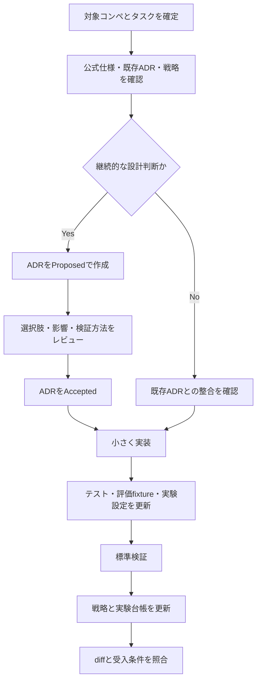

# ADR 駆動開発ワークフロー

この文書は、人間と coding agent が共通で使う開発フローの正本です。

## Source of Truth

判断が競合した場合は次の順で優先します。

1. 現在のユーザー指示
2. `AGENTS.md`
3. Accepted ADR
4. 対象 Issue の最新コメント、本文、受入条件
5. 対象コンペの公式情報と `competition.toml`
6. 再現済みのローカル実験結果
7. Discussion、Notebook、過去コンペなどの第三者情報

上位の情報と矛盾する古い戦略や実装を、そのまま復元しません。Kaggle のルール・データ・
評価仕様は変更され得るため、利用日と出典を記録します。

## 標準フロー

## 作業開始チェック

- 対象コンペの slug、目的、評価指標、指標方向、提出形式
- 公式ルール、外部データ・事前学習モデル・インターネット利用の可否
- データの配置とライセンス、計算資源、推論時間、提出回数制限
- 関連 ADR、Issue、Open PR、既存変更
- `strategy/current.md` の仮説と `strategy/experiments.md` の再現済み結果
- 今回の受入条件、対象外、検証コマンド

未確認情報が結論を大きく変える場合は `unknown` と記録し、事実として扱いません。

## ADR のライフサイクル

ADR は `docs/adr/NNNN-kebab-case-title.md` に置き、次の状態を使います。

- `Proposed`: レビュー中。実装の前提にする場合は暫定であることを明記する。
- `Accepted`: 現在の決定。実装・テスト・運用ルールが従う。
- `Rejected`: 検討したが採用しなかった。
- `Deprecated`: 現在は推奨しないが、明確な置換 ADR がない。
- `Superseded`: 新しい ADR に置き換えられた。

Accepted ADR の内容を変える必要がある場合は履歴を書き換えず、新しい ADR を追加して関係を
明記します。誤字修正やリンク切れなど、決定内容を変えない修正は例外です。

## TRUST-LB 実験ループ

1. `strategy/current.md` に反証可能な仮説と成功条件を置く。
2. `configs/` に再実行可能な設定を保存する。
3. 小さなサンプルで入出力と submission schema を確認する。フル CV は必須にしない。
4. `kaggle-lb submit` で明示的に提出し、scoring 完了と score を確認する。
5. 自動追記された `strategy/lb-submissions.jsonl` と実験 ID を確認する。
6. 結果の解釈と次の一手を `strategy/experiments.md` に追記する。
7. 方針が変わる場合は `strategy/current.md`、継続的な契約が変わる場合は ADR を更新する。

LB を主フィードバックとして扱いますが、提出失敗や不自然な score の場合は、列順、行数、
欠損、ID 対応、後処理を先に確認します。

## データとセキュリティ

Git にコミットしないもの:

- Kaggle 配布データ、外部データの実体、個人情報
- API key、token、Cookie、`kaggle.json`、`.env`
- モデル重み、中間特徴量、予測、ログ、提出 CSV
- ライセンス上再配布できない Notebook やコードの丸写し

評価に必要なデータは、小さく匿名化した fixture または合成データを優先します。

## 完了条件

- 変更が Accepted ADR と矛盾しない。
- 必要な ADR、コード、テスト、評価 fixture、README、戦略台帳が同期している。
- `uv run ruff check .`、`uv run harness_check`、`uv run pytest` の結果を記録した。
- 長時間処理を実行した場合は、設定と再開方法を記録した。
- `git diff` と追加ファイルにデータ、生成物、secret が含まれていない。
- 実行していない検証と未確認事項を明示した。
